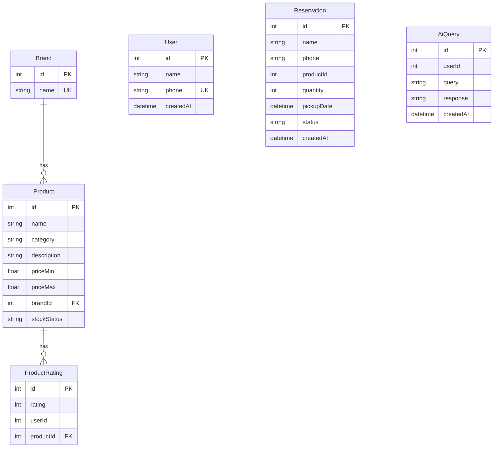

# 📘 Vasavi Traders — Codebase Guide

> **Last updated:** March 2026
> A comprehensive guide for new developers joining the project.

---

## 📌 Project Overview

**Vasavi Traders** is a full-stack web application for a construction materials and hardware store. It allows customers to:

- Browse a **product catalog** (cement, pipes, paints, etc.)
- **Compare products** side by side
- **Reserve materials** online (with store pickup)
- Chat with **Nova AI** — an AI assistant for material estimation & crack detection (with Telugu voice support)

**Live URLs:**
| Environment | URL |
|---|---|
| Frontend (Vercel) | `https://vasavi-traders-website-3gpu.vercel.app` |
| Backend API | Hosted on Render |

---

## 🏗️ Project Structure

```
web_2/
├── FRONTEND/          # React + Vite SPA
├── BACKEND/           # Express.js REST API
├── ai-service/        # (Planned) AI microservice — currently empty
└── .gitignore
```

---

## 🎨 Frontend (`FRONTEND/`)

### Tech Stack

| Technology | Version | Purpose |
|---|---|---|
| React | 18.3 | UI framework |
| Vite | 5.4 | Build tool & dev server |
| Tailwind CSS | 4.2 | Utility-first styling |
| react-router-dom | 7.x | Client-side routing |
| axios | 1.x | HTTP client for API calls |
| framer-motion | 12.x | Animations |
| lucide-react | 0.577 | Icon library |
| @react-three/fiber | 9.x | 3D rendering (Three.js) |

### Directory Layout

```
FRONTEND/src/
├── main.jsx              # React entry point (renders <App />)
├── App.jsx               # Router setup — defines all routes
├── index.css             # Global styles + design tokens + Tailwind
├── App.css               # Additional app-level styles
│
├── pages/
│   ├── Home.jsx          # Landing page with hero section & 3D illustration
│   ├── Products.jsx      # Product catalog with search, filter & compare
│   ├── Contact.jsx       # Store location, phone, email, hours
│   └── NovaAssistant.jsx # AI chatbot with voice & image upload
│
├── components/
│   ├── Navbar.jsx        # Sticky top navigation (responsive, mobile menu)
│   ├── Footer.jsx        # 4-column footer with links & contact info
│   ├── Modal.jsx         # Reservation form modal (used on Products page)
│   └── ThreeDHero.jsx    # Animated floating construction elements (Three.js/Fiber)
│
└── assets/               # Static assets (images, etc.)
```

### Routing

Defined in `App.jsx` using `react-router-dom`:

| Route | Page Component | Description |
|---|---|---|
| `/` | `Home` | Landing page |
| `/products` | `Products` | Material catalog |
| `/contact` | `Contact` | Store contact info |
| `/nova` | `NovaAssistant` | AI assistant chat |

### Design System (in `index.css`)

The app uses **CSS custom properties** for theming, defined inside a `@theme` block:

| Token | Value | Usage |
|---|---|---|
| `--color-accent` | `#FFD700` (Gold) | Primary accent / CTAs |
| `--color-warm` | `#C5A000` | Hover state for accent |
| `--color-bg` | `#050505` | Page background (near-black) |
| `--color-surface` | `#0F0F0B` | Card / panel backgrounds |
| `--color-border` | `#22221A` | Borders & dividers |
| `--color-text` | `#FFFFFF` | Primary text |
| `--color-muted` | `#8E8E82` | Secondary / muted text |

**Fonts:** `Inter` (body), `Poppins` (headings) — loaded from Google Fonts.

**Reusable CSS classes:** `.card`, `.btn-primary`, `.btn-outline`, `.subtle-divider`

### Key Page Details

#### `Home.jsx`
- Hero section with headline, stats (500+ Projects, 12+ Years, 50+ Brands), and CTA buttons
- Renders `<ThreeDHero />` — animated floating construction elements
- Trusted brands strip at the bottom

#### `Products.jsx`
- Fetches products from `VITE_API_URL/api/products` via `axios`
- Falls back to **hardcoded data** if the API is unreachable
- Features: search bar, category filter tabs, product cards with "Reserve" button
- **Compare mode**: select up to 2 products to compare side by side
- Opens `<Modal />` for reservation on "Reserve" click

#### `Modal.jsx` (Reservation Form)
- Form fields: name, phone, quantity, pickup date
- POSTs to `VITE_API_URL/api/reservations`
- Shows success state on completion (gracefully handles API errors)

#### `NovaAssistant.jsx`
- Chat-style interface with message bubbles
- **Text queries**: hardcoded responses for material estimation (cement, pipes, paint)
- **Image upload**: simulated crack analysis (random structural vs. non-structural)
- **Telugu voice**: uses Web Speech API (`SpeechRecognition` for input, `SpeechSynthesisUtterance` for output)
- TTS plays automatically after Nova responds

### Environment Variables

Create `FRONTEND/.env`:
```
VITE_API_URL=http://localhost:5000
```
For production, this points to the Render backend URL.

---

## ⚙️ Backend (`BACKEND/`)

### Tech Stack

| Technology | Version | Purpose |
|---|---|---|
| Express | 5.x | HTTP server & routing |
| Prisma | 5.22 | ORM & database toolkit |
| PostgreSQL | — | Production database |
| SQLite | — | Local dev database (`prisma/dev.db`) |
| cors | 2.x | Cross-origin requests |
| dotenv | 17.3.1 | Environment variable loading |

### Entry Point — `index.js`

The server exposes **4 endpoints**:

| Method | Endpoint | Description |
|---|---|---|
| `GET` | `/api/health` | Health check → `{ status: "ok" }` |
| `GET` | `/api/products` | Fetch all products (with brand info) |
| `POST` | `/api/reservations` | Create a new reservation |
| `POST` | `/api/nova` | AI assistant query endpoint |

**CORS** is configured to allow:
- `https://vasavi-traders-website-3gpu.vercel.app` (production)
- `http://localhost:5173` (local dev)

**Port:** Defaults to `5000`, configurable via `PORT` env var.

### Database Schema (`prisma/schema.prisma`)



**Key models:**
- **Brand** — Product brand (e.g., Asian Paints, UltraTech)
- **Product** — Materials with price range, category, and brand relation
- **Reservation** — Customer pickup reservations (status defaults to `"Pending"`)
- **AiQuery** — Stores AI assistant conversation logs
- **User** — Customer profiles (phone is unique)
- **ProductRating** — Ratings per product

> **⚠️ Database Architectural Flaws:**
> - **Orphaned Reservations:** The `Reservation` model stores customer `name` and `phone` as plain text strings. There is no foreign key linking it to the `User` table, meaning reservations cannot be reliably queried per user.
> - **Broken AI Query Relation:** `AiQuery.userId` is defined as a raw integer without a proper Prisma `@relation`. This is not a real database constraint and will fail standard relational queries.

### Seed Data (`seed.js`)

Populates the database with:
- **8 brands**: Asian Paints, Berger, Nagarjuna Cement, UltraTech, Ramco, Supreme, Ashirvad, Finolex
- **8 products** across 3 categories: Cement, Pipes, Paint
- Uses `upsert` for brands (idempotent) and checks product count before seeding

### NPM Scripts

| Script | Command | Description |
|---|---|---|
| `dev` | `nodemon index.js` | Start dev server with hot-reload |
| `start` | `prisma migrate deploy && node seed.js && node index.js` | Production start (migrate → seed → serve) |
| `build` | `prisma generate` | Generate Prisma client |
| `postinstall` | `prisma generate` | Auto-generate client after `npm install` |

### Environment Variables

Create `BACKEND/.env`:
```
DATABASE_URL=<your-postgresql-connection-string>
```
For local dev with SQLite, update `schema.prisma` provider to `"sqlite"` and set:
```
DATABASE_URL="file:./dev.db"
```

---

## 🚀 Getting Started

### Prerequisites
- **Node.js** ≥ 18.x
- **npm** (comes with Node)
- **PostgreSQL** (for production) or use the included SQLite `dev.db` for local dev

### 1. Clone the Repository

```bash
git clone https://github.com/bharathvarma403-talent/vasavi-traders-website.git
cd vasavi-traders-website
```

### 2. Backend Setup

```bash
cd BACKEND
npm install               # Installs deps + auto-generates Prisma client
npx prisma migrate dev    # Run migrations (creates tables)
node seed.js              # Seed initial data
npm run dev               # Start backend on http://localhost:5000
```

### 3. Frontend Setup

```bash
cd FRONTEND
npm install
npm run dev               # Start frontend on http://localhost:5173
```

### 4. Verify

- Open `http://localhost:5173` in your browser
- Products page should load data from the backend
- Test the reservation modal on any product
- Try the Nova AI assistant at `/nova`

---

## 🌐 Deployment

| Service | Platform | Notes |
|---|---|---|
| Frontend | **Vercel** | Auto-deploys from `main` branch. Set `VITE_API_URL` in Vercel env vars. |
| Backend | **Render** | Uses `npm start` script (migrate → seed → serve). Set `DATABASE_URL` in Render env vars. |
| Database | **PostgreSQL** (via Render or external) | Connection string goes in `DATABASE_URL`. |

---

## 📁 Key Files Quick Reference

| File | Purpose |
|---|---|
| `FRONTEND/src/App.jsx` | Route definitions |
| `FRONTEND/src/index.css` | Design tokens + global styles |
| `FRONTEND/src/pages/Products.jsx` | Main product catalog logic |
| `FRONTEND/src/components/Modal.jsx` | Reservation form |
| `FRONTEND/src/pages/NovaAssistant.jsx` | AI chatbot |
| `BACKEND/index.js` | API server & endpoints |
| `BACKEND/prisma/schema.prisma` | Database schema |
| `BACKEND/seed.js` | Database seeder |

---

## 🚨 Critical Bugs & Vulnerabilities

> **WARNING:** The following issues must be resolved before this application can be safely deployed to production.

- **Fake AI Integration:** The `/api/nova` endpoint returns hardcoded echo responses. It does **not** connect to any real LLM or AI service.
- **Randomized Crack Detection:** The image analysis for structural cracks uses `Math.random()` to guess if a structure is safe. No real computer vision or validation occurs.
- **Unsanitized User Inputs:** Forms (like reservations) and AI query endpoints have no validation or sanitization mechanisms in place, exposing the system to injection and security risks.

---

## 🔮 Planned Features

- **`ai-service/`** — A dedicated AI microservice (directory exists but is currently empty)

---

## 💡 Tips for New Developers

1. **Styling convention**: Components use inline `style={{ }}` with CSS variables (e.g., `var(--color-accent)`) combined with Tailwind classes. Refer to `index.css` for all available tokens.
2. **API fallback**: `Products.jsx` has a hardcoded fallback dataset if the backend is down — useful for frontend-only development.
3. **Icons**: All icons come from `lucide-react`. Browse available icons at [lucide.dev](https://lucide.dev).
4. **Database changes**: After modifying `schema.prisma`, run `npx prisma migrate dev --name <migration-name>` to create a migration.
5. **Hot reload**: Both frontend (`vite`) and backend (`nodemon`) support hot-reload during development.
