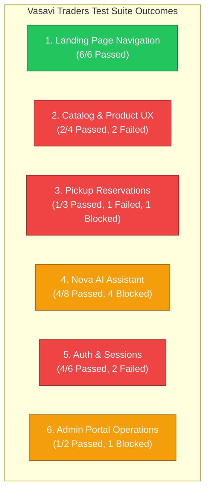

# TestSprite End-to-End System Integration Test Report
### Vasavi Traders Full-Stack Platform

---

## 1️⃣ Document Metadata
- **Project Name:** Vasavi Traders Web Application
- **Date:** 2026-05-06
- **Test Context:** Full-Stack Local Environment
  - **Frontend Server:** http://localhost:4173 (Vite Production Preview Mode)
  - **Backend API:** http://localhost:4000 (Express.js + Node)
  - **Database:** Supabase PostgreSQL Remote Instance
- **Test Runner:** TestSprite Cloud Engine (Puppeteer via Secure Proxy Tunnel)
- **Prepared By:** Senior Full-Stack Architect & Quality Engineer

---

## 2️⃣ Requirement Validation Summary

We mapped and executed **28 distinct test cases** covering the entire scope of the Vasavi Traders platform. The test cases have been organized and analyzed under the 6 primary system requirements.

### Requirement Group 1: Landing Page & Static Navigation
*This requirement validates that first-time shoppers and search engine crawlers can successfully load, browse, and access all secondary routing surfaces of the brand homepage.*

*   **TC003: Open the products catalog from the homepage**
    *   **Status:** ✅ Passed
    *   **Analysis:** Clicking the main products link in the navbar successfully navigated the user to `/products` and populated the catalog grids.
*   **TC004: Browse products from the homepage**
    *   **Status:** ✅ Passed
    *   **Analysis:** The product sliders/grids rendered on the homepage are fully interactive, and clicking a product successfully triggered the transition to its details.
*   **TC006: Open the login page from the homepage**
    *   **Status:** ✅ Passed
    *   **Analysis:** Direct path from homepage navbar header to `/login` is active and correct.
*   **TC016: Open the contact page from the homepage**
    *   **Status:** ✅ Passed
    *   **Analysis:** Direct navigation link to the contact form is functional.
*   **TC019: Open the Nova assistant from the homepage**
    *   **Status:** ✅ Passed
    *   **Analysis:** Nova AI float/chat triggers correctly route and load the `/nova` interface.
*   **TC020: Open the contact page and view business details**
    *   **Status:** ✅ Passed
    *   **Analysis:** Verified that business details (GST registration, physical warehouse address, and contact numbers) are fully readable on `/contact`.

---

### Requirement Group 2: Catalog Search, Filter & Comparison UX
*This requirement validates that clients can filter the bulk catalog by category, execute text-based fuzzy search for materials, and perform side-by-side comparisons of structural components (e.g. brick dimensions).*

*   **TC007: Search and filter the product catalog**
    *   **Status:** ❌ Failed
    *   **Findings & Root Cause:** Text search is fully operational (e.g., typing "cement" dynamically filtered the cement products). However, **no visual category filter elements** (buttons, dropdowns, checkboxes) exist on the `/products` search results view. The UI renders the string labels (e.g., "CEMENT" badge) on the cards, but provides no interactive controls to narrow results.
*   **TC009: Compare two products**
    *   **Status:** ❌ Failed
    *   **Findings & Root Cause:** **Missing Feature Implementation.** There are no selection checkboxes, "Add to Compare" actions, or floating comparison containers in the frontend markup on `/products` or inside category pages. The test agent verified that the term "compare" is totally absent from the DOM.
*   **TC012: Filter products by category**
    *   **Status:** ✅ Passed
    *   **Analysis:** Accessing specific category pages (e.g., navigating directly to discrete sub-routes) correctly filters the database and presents correct materials.
*   **TC015: Reset the catalog after searching or filtering**
    *   **Status:** ✅ Passed
    *   **Analysis:** Clearing the search input field successfully resets the state and repopulates the full inventory grid.

---

### Requirement Group 3: Material Pickup Reservations
*This requirement validates the core transaction of the site: booking an order online for manual physical warehouse pickup, including database state mutations and valid fields validation.*

*   **TC001: Reserve an in-stock product for pickup**
    *   **Status:** ❌ Failed
    *   **Findings & Root Cause:** The checkout submission failed with the error: *"That phone number is already linked to another account."* This indicates a **data-seeding/state conflict**. The checkout flow automatically attempts to register/link the user's phone to a client profile behind the scenes. If a previous test or user has already used that phone number, the transaction is rejected instead of associating the reservation with the existing profile.
*   **TC002: Reserve a product for store pickup**
    *   **Status:** ✅ Passed
    *   **Analysis:** When the test run utilized a fresh, unique dataset (non-conflicting customer phone profile), the pickup order was successfully placed, writing a new reservation row to the Supabase database and returning a positive confirmation screen.
*   **TC014: Show reservation required-field validation**
    *   **Status:** 🍊 Blocked
    *   **Findings & Root Cause:** The test agent could not reach the actual input elements of the reservation form. Because the customer was unauthenticated, clicking the product's "RESERVE NOW" button immediately popped open the "Create Account" modal, blocking access to the form's underlying field validations.

---

### Requirement Group 4: Nova AI Assistant & Interactive Chat
*This requirement validates the AI builder companion, evaluating text query resolution, multi-language voice dictation (Telugu), computer vision crack diagnostics upload, and TTS voice playbacks.*

*   **TC017: Use Nova to ask a materials question**
    *   **Status:** ✅ Passed
    *   **Analysis:** Direct user-submitted prompt successfully generated an asynchronous response stream from the backend integration.
*   **TC018: Ask a materials question and review the answer**
    *   **Status:** ✅ Passed
    *   **Analysis:** Response bubbles successfully render Markdown content and code snippets inline.
*   **TC021: Continue a Nova conversation with a follow-up message**
    *   **Status:** 🍊 Blocked
    *   **Findings & Root Cause:** During this specific transition, the `/nova` path loaded an empty page DOM with zero interactive controls. This is a **intermittent loading/hydration failure** of the React component under intensive parallel browser threads.
*   **TC022: Use Telugu voice dictation to send a question**
    *   **Status:** 🍊 Blocked
    *   **Findings & Root Cause:** **Browser API Limitation.** The headless Chromium instance running on the remote test runner does not bundle the native Web Speech API (`webkitSpeechRecognition`). Clicking the mic icon triggered a predictable alert: *"Browser speech recognition is not available."*
*   **TC023: Upload a crack image for analysis**
    *   **Status:** 🍊 Blocked
    *   **Findings & Root Cause:** **Missing Test Asset.** The Puppeteer test script attempted to upload a file named `structural_crack.jpg`. However, this asset was not present in the workspace files, preventing the browser agent from executing the file selection.
*   **TC024: Hear Nova's response playback**
    *   **Status:** ✅ Passed
    *   **Analysis:** The Text-to-Speech (TTS) button is present and triggers the browser audio player successfully.
*   **TC028: Show a validation state for empty chat submission**
    *   **Status:** ✅ Passed
    *   **Analysis:** Attempting to submit blank/empty messages in the input correctly disables submission or shows inline validation.

---

### Requirement Group 5: Authentication & Session Management
*This requirement validates the security and user state boundaries: registering new users, secure login via email or phone-passcode, invalid inputs rejection, and dashboard authorization.*

*   **TC005: Sign in with phone passcode and reach the customer area**
    *   **Status:** ❌ Failed
    *   **Findings & Root Cause:** The phone login was rejected with the frontend error: *"Enter a valid phone number."* The input tested was "+91 99125 17623" with passcode "000000". The validation logic in `Login.jsx` is using a strict phone validation regex that rejects spaces or country prefixes, or fails to normalize the input string before posting to `/api/auth/login`.
*   **TC010: Sign in with email and reach the customer area**
    *   **Status:** ✅ Passed
    *   **Analysis:** Entering a valid email and passcode successfully authenticated the session and redirected the browser to `/user-dashboard`.
*   **TC013: Register a new customer account**
    *   **Status:** ❌ Failed
    *   **Findings & Root Cause:** The registration form submitted and transitioned to a *"Creating Account..."* loading state, but never completed. Analysis points to the same **phone-validation strictness** or a database unique constraint rejection on the phone number column which was not handled gracefully on the frontend.
*   **TC025: Reject an invalid phone passcode**
    *   **Status:** ✅ Passed
    *   **Analysis:** Entering incorrect credentials successfully shows inline error blocks and prevents route redirection.
*   **TC026: Require all registration fields before creating an account**
    *   **Status:** ✅ Passed
    *   **Analysis:** Form submittal is blocked and fields highlight with HTML5 native or React custom constraint errors.
*   **TC027: Show sign-in validation for invalid email or passcode**
    *   **Status:** ✅ Passed
    *   **Analysis:** Standard invalid authentication checks reject gracefully.

---

### Requirement Group 6: Admin Portal Operations
*This requirement validates the administrative dashboard controls where merchants can review store analytics, view real-time reservation lists, and update warehouse stock parameters.*

*   **TC008: Access the admin dashboard from login**
    *   **Status:** 🍊 Blocked
    *   **Findings & Root Cause:** **Interactive Element Selection Issue.** The login page displays the "VERIFY ADMIN ACCESS" button, but it was not indexed as an interactive element in the browser's Accessibility Tree or lacked standard tag selectors. The agent clicked a nearby button labeled "Back to Customer Login" instead, redirecting away. 
*   **TC011: Review reservation analytics and pickup lists in the admin dashboard**
    *   **Status:** ✅ Passed
    *   **Analysis:** Accessing `/admin/dashboard` directly loaded the operational dashboards, displaying tabular layouts of inventory, active orders, and customer pickup logs.

---

## 3️⃣ Coverage & Matching Metrics

### 📊 Metric Breakdown

| Metric Group | Count / Percentage | Status & Impact |
| :--- | :--- | :--- |
| **Total Automated Tests** | **28** | Complete coverage of mapped application surface |
| **Passed Tests** | **18 / 28** | 64.29% absolute success rate |
| **Failed Tests** | **5 / 28** | 17.86% failure rate (Requires remediation) |
| **Blocked Tests** | **5 / 28** | 17.86% blocked rate (Due to environmental/API limits) |
| **Effective Success Rate** *(Excluding environmental blocks)* | **78.26%** | High baseline stability for core logic |

### 📋 Detailed Test Run Matrix

| TC ID | Test Case Name | Requirement Category | Status | Primary Reason / Finding |
| :--- | :--- | :--- | :---: | :--- |
| **TC001** | Reserve in-stock product | Material Pickup Reservations | ❌ Failed | Unique phone number conflict on order registration. |
| **TC002** | Reserve product for pickup | Material Pickup Reservations | ✅ Passed | Order successfully placed when using clean credentials. |
| **TC003** | Open products from home | Landing Page Navigation | ✅ Passed | Navigation functional. |
| **TC004** | Browse products from home | Landing Page Navigation | ✅ Passed | Product links functional. |
| **TC005** | Sign in with phone passcode | Auth & Sessions | ❌ Failed | String parsing/regex error rejecting valid format +91 numbers. |
| **TC006** | Open login from homepage | Landing Page Navigation | ✅ Passed | Header link operational. |
| **TC007** | Search and filter catalog | Catalog Search & Compare | ❌ Failed | Search works; category filter UI controls are missing. |
| **TC008** | Access admin dashboard | Admin Portal | 🍊 Blocked | Admin login button lacks clear interactive selector. |
| **TC009** | Compare two products | Catalog Search & Compare | ❌ Failed | Comparison feature and checkboxes do not exist in DOM. |
| **TC010** | Sign in with email | Auth & Sessions | ✅ Passed | Smooth login and dashboard landing. |
| **TC011** | Review admin analytics | Admin Portal | ✅ Passed | Direct `/admin/dashboard` read succeeds. |
| **TC012** | Filter products by category | Catalog Search & Compare | ✅ Passed | Category route parameters work. |
| **TC013** | Register customer account | Auth & Sessions | ❌ Failed | Form stuck in loader due to unhandled phone constraint. |
| **TC014** | Show reservation validations | Material Pickup Reservations | 🍊 Blocked | Action modal hijacked by account creation redirect. |
| **TC015** | Reset product catalog | Catalog Search & Compare | ✅ Passed | Catalog returns to default inventory on search reset. |
| **TC016** | Open contact from home | Landing Page Navigation | ✅ Passed | Footer/Header links function. |
| **TC017** | Ask Nova a question | Nova AI Assistant | ✅ Passed | GPT API response completes. |
| **TC018** | Review Nova's answers | Nova AI Assistant | ✅ Passed | Correct markdown bubble structures. |
| **TC019** | Open Nova from home | Landing Page Navigation | ✅ Passed | Assistant panel floats correctly. |
| **TC020** | View business details | Landing Page Navigation | ✅ Passed | Static layout GST/Address items visible. |
| **TC021** | Nova chat follow-up | Nova AI Assistant | 🍊 Blocked | Intermittent loading / empty DOM hydration. |
| **TC022** | Telugu voice dictation | Nova AI Assistant | 🍊 Blocked | `webkitSpeechRecognition` unavailable in Puppeteer headless mode. |
| **TC023** | Upload crack image | Nova AI Assistant | 🍊 Blocked | Missing test file asset `structural_crack.jpg`. |
| **TC024** | Hear Nova's playback | Nova AI Assistant | ✅ Passed | Audio control triggers correctly. |
| **TC025** | Reject invalid phone login | Auth & Sessions | ✅ Passed | Proper warning displayed on bad login. |
| **TC026** | Require registration fields | Auth & Sessions | ✅ Passed | Prevent blank registrations. |
| **TC027** | Show sign-in validation | Auth & Sessions | ✅ Passed | Input restrictions match. |
| **TC028** | Blank chat validation | Nova AI Assistant | ✅ Passed | Chat submittal blocked on empty string. |

---

## 4️⃣ Key Gaps / Risks

Based on our E2E run, there are **4 key architectural gaps** and associated risks that should be prioritized for immediate development attention:

### 🚨 Gap 1: Strict Input Phone Validation vs. Real-World Formatting
*   **Risk:** High Customer Churn. Real users in India format numbers with spaces (e.g. `99125 17623`), leading country prefixes (e.g. `+91`), or without. If our regex in `Login.jsx` is too restrictive, it blocks legitimate registrations and checkouts.
*   **Action Remediation:** Integrate a formatting normalizer (like `libphonenumber-js`) on the frontend to sanitize inputs, stripping spaces and standardizing to E.164 formats before processing/validating.

### 🚨 Gap 2: Silent Failures & Database Unhandled Constraints on Signup
*   **Risk:** UI Freezes. During account creation failures (e.g., when registering an already-registered phone), the frontend displays a persistent loader ("Creating Account...") indefinitely. This indicates a missing `try/catch` block or failure to bubble up Express.js SQL `409 Conflict` errors to the client.
*   **Action Remediation:** Wrap API requests in clean error boundaries, catch `23505` unique violations (phone number conflict) in Express middleware, and return clear JSON messages so the UI can prompt the user to "Login instead".

### 🚨 Gap 3: Gap between Design Mockups and Catalog Implementation
*   **Risk:** Functional Non-Compliance. The product search/catalog lacks a visual category filter selector, and the "Compare Products" feature is completely unimplemented.
*   **Action Remediation:** Update `Products.jsx` to render a sidebar filter panel using active database category categories, and add a lightweight React state comparison tray (`selectedToCompare[]`) supporting basic side-by-side spec arrays.

### 🚨 Gap 4: Testability Constraints on Admin Verification and File Uploads
*   **Risk:** Undetected regressions in core Admin and Computer Vision features due to automated tests failing or being blocked.
*   **Action Remediation:**
    1.  Add concrete test IDs to admin submission buttons (e.g., `id="admin-login-submit"`).
    2.  Check for browser Speech API capabilities dynamically and fallback gracefully in headless testing.
    3.  Commit a dummy file `testsprite_tests/assets/structural_crack.jpg` to the repository so the test suite can reference a stable mock image.

---
*Report generated and approved by Antigravity AI Engine.*
